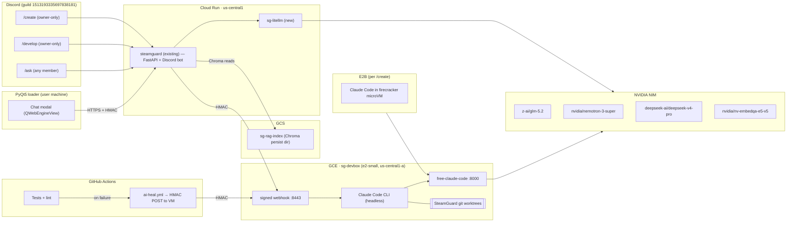

# AI Integration Plan — SteamGuard

**Status:** Approved · v3 · 2026-07-08
**Owner:** @rivvak
**GCP project:** `fabled-mystery-474200-i1`
**Cloud Run region:** `us-central1`

Adds AI across three surfaces: (1) a self-healing developer agent for the repo, (2) an in-product assistant for end users (loader + Discord `/ask`), and (3) two owner-only Discord commands — `/develop` (Claude Code on the repo) and `/create` (Claude Code in an E2B sandbox, returns a zip).

All inference goes through **NVIDIA NIM** (`https://integrate.api.nvidia.com/v1`, OpenAI-compatible) — either directly via **LiteLLM** for user-facing surfaces, or via the **[free-claude-code](https://github.com/Alishahryar1/free-claude-code) proxy** which speaks the Anthropic Messages API to Claude Code CLI.

---

## 0. Locked Decisions (v3.2)

> **v3.2 patch (2026-07-08)**: Phase 1 shipped and is live in production (see [Issue #7](https://github.com/rivvak/SteamGuard/issues/7)). Phase 2 code has landed — sg-devbox VM + `/develop` + CI self-heal. See [`docs/phase2/`](./phase2/) for the sub-plan, [`docs/phase2/SECURITY.md`](./phase2/SECURITY.md) for the threat model, and [`docs/phase2/RUNBOOK.md`](./phase2/RUNBOOK.md) for the deploy steps.
>
> **v3.1 patch (2026-07-08)**: Corrected `/ai/ask` auth from "JWT session token" to the actual **HMAC(SECRET_KEY, "key:hwid")** scheme used by `/verify` and other license-gated routes. `JWT_SECRET` is retained in Secret Manager for potential future use but is not the auth mechanism for AI endpoints in Phase 1.


| Key | Value |
|---|---|
| GCP project | `fabled-mystery-474200-i1` |
| Region | `us-central1` |
| Existing Cloud Run service | `steamguard` |
| Cloud Run service account | `775181381055-compute@developer.gserviceaccount.com` |
| New Cloud Run service (this plan) | `sg-litellm` |
| GCE VM (dev-side agent) | `sg-devbox`, `e2-small`, `us-central1-a` |
| Discord guild ID | `1513193335697838181` |
| Owner Discord user ID | `1513150836472021074` |
| Discord bot token secret | `DISCORD_BOT_TOKEN` |
| GitHub App | `rivvak-sg-heal` (App ID `4249863`, Installation ID `145288024`) |
| GitHub App secrets | `SG_HEAL_APP_ID`, `SG_HEAL_INSTALLATION_ID`, `SG_HEAL_PRIVATE_KEY` |
| Existing auth secrets | `JWT_SECRET`, `HMAC_SECRET_KEY`, `SECRET_KEY` |
| Vector store | **Chroma** embedded in the FastAPI container, backed by a GCS bucket (`sg-rag-index`) — no Cloud SQL |
| Auth on `/ai/ask` | Reuse existing **HMAC(SECRET_KEY, "key:hwid")** scheme — same as `/verify` and other license-gated routes. Loader signs `key:hwid` with the shared `SECRET_KEY`; server recomputes and compares. **Not JWT.** |
| `/develop` PR reviewer | Auto-request review from `@rivvak` |
| Commit signing | SSH (bot signing key stored on the VM) |
| Chat panel UX | Modal from a "?" button in the PyQt5 loader |
| Rate limits | 30 req/hr per user on `/ai/ask`; 5/hr on `/create` |
| Voice notes | Off in Phase 3, revisit later |
| Auto-commit allow-list | `docs/**`, `tests/**`, `**/*.md`, `requirements*.txt`, `pyproject.toml`, `dashboard/**` |

**NIM key:** the user has chosen to keep using `nvapi-JjGi1zqt1AdcM1lszGOy_...` despite it appearing in chat transcripts. Documented here so the risk decision is explicit. Stored in Secret Manager as `NVIDIA_NIM_API_KEY`.

---

## 1. Goals

1. **Self-healing dev loop** — CI failure on `rivvak/SteamGuard` → Claude Code (via FCC → NIM) reads logs → commits patch directly to `main` for **allow-listed paths only**, otherwise opens a PR.
2. **In-product assistant** — end users of the loader ask questions via a modal chat panel or a Discord `/ask` command. RAG-backed on `docs/`. Free to all logged-in loader users.
3. **Owner-only `/develop`** — Discord command routed to Claude Code on the VM against the SteamGuard repo. Defaults to opening a PR on `ai/develop/<slug>`; `--push-main` allowed only when every changed path is inside the allow-list.
4. **Owner-only `/create`** — Discord command that spins up an ephemeral E2B sandbox, runs Claude Code with your prompt, returns the output as a **zip attachment** in Discord.

## 2. Non-Goals

- No AI access to license validation, HWID, or certificate-pinning code — hard-blocked (§8).
- No auto-merge of PRs that touch anything outside the allow-list.
- No shipping of any NIM/GitHub secret to the desktop client. All model calls go through Cloud Run or the VM proxy.
- No public exposure of the FCC Admin UI or the VM webhook — both bound to loopback / private ingress and reached through IAP or a signed HMAC.

---

## 3. Architecture



**Models per surface** (swappable via LiteLLM/FCC config):

| Surface | Model | Why |
|---|---|---|
| Self-heal + `/develop` (Claude Code via FCC) | `z-ai/glm-5.2` | Leading open-weight SWE-bench Pro / Terminal-Bench |
| User `/ask` + loader chat (RAG) | `nvidia/nemotron-3-super-120b-a12b` | NIM-native TensorRT throughput/cost for grounded Q&A |
| `/create` code generation | `deepseek-ai/deepseek-v4-pro` | Highest raw coding accuracy; permissive for low-level code |
| Embeddings | `nvidia/nv-embedqa-e5-v5` | Same NIM key, `input_type=passage/query` |

---

## 4. Repository Additions

```
ai/
  __init__.py
  client.py                # OpenAI() factory pointed at LiteLLM
  prompts/
    ask_system.md
    develop_system.md
    create_system.md
  rag/
    ingest.py              # markdown → chunks → embeddings → Chroma → GCS
    retrieve.py
    chroma_gcs.py          # thin GCS-backed persistent client

server/
  routes/
    ai_ask.py              # POST /ai/ask (HMAC-gated, RAG, streaming)
    ai_chat.py             # POST /ai/chat (multi-turn, session-scoped)
    ai_hooks.py            # /internal/develop, /internal/heal (HMAC-signed)
  bot/
    cogs/
      ask_cog.py           # /ask
      develop_cog.py       # /develop  (owner-gated, forwards to VM webhook)
      create_cog.py        # /create   (owner-gated, forwards to E2B)

vm/                        # deployed to GCE sg-devbox, NOT Cloud Run
  README.md
  cloud-init.yaml          # provisions uv + FCC + Claude Code + webhook svc
  fcc-config/
    settings.yaml          # provider=nim, model=z-ai/glm-5.2
  develop-webhook/
    server.py              # FastAPI on :8443, HMAC-signed
    path_guard.py          # enforces auto-commit allow-list

sandbox/
  create_runner.py         # E2B orchestration (called from create_cog.py)
  Dockerfile.claude        # image with Claude Code + FCC client

.github/
  workflows/
    ai-heal.yml            # on workflow_run failure → HMAC POST to VM
  CODEOWNERS
  AGENTOWNERS.md

deploy/
  litellm/
    config.yaml
    Dockerfile
    cloudrun.yaml          # sg-litellm service manifest
  cloudrun/
    steamguard.yaml.patch  # patch existing steamguard service to add
                           # SG_HEAL_APP_ID etc. env bindings

docs/
  AI_INTEGRATION_PLAN.md   # this document
  AI_USAGE.md              # end-user help for /ask + chat modal
  AI_AGENT_RULES.md        # what agents may/may not touch
```

Client-side (loader):

```
loader/
  ai/
    chat_panel.py          # QWebEngineView modal launched from "?" button
    chat_ui/
      index.html
      chat.js
      chat.css
```

---

## 5. LiteLLM Config (`deploy/litellm/config.yaml`)

```yaml
model_list:
  - model_name: sg-primary
    litellm_params:
      model: nvidia_nim/z-ai/glm-5.2
      api_key: os.environ/NVIDIA_NIM_API_KEY

  - model_name: sg-rag
    litellm_params:
      model: nvidia_nim/nvidia/nemotron-3-super-120b-a12b
      api_key: os.environ/NVIDIA_NIM_API_KEY

  - model_name: sg-code
    litellm_params:
      model: nvidia_nim/deepseek-ai/deepseek-v4-pro
      api_key: os.environ/NVIDIA_NIM_API_KEY

  - model_name: sg-embed
    litellm_params:
      model: nvidia_nim/nvidia/nv-embedqa-e5-v5
      api_key: os.environ/NVIDIA_NIM_API_KEY

router_settings:
  fallbacks:
    - sg-primary: ["sg-code"]
    - sg-rag:     ["sg-primary"]
  num_retries: 2
  request_timeout: 30

litellm_settings:
  drop_params: true

general_settings:
  master_key: os.environ/LITELLM_MASTER_KEY
```

Deployed as new Cloud Run service **`sg-litellm`** in `us-central1`, private ingress only, invocable only by the `steamguard` service's SA (`775181381055-compute@developer.gserviceaccount.com`).

Reference: [LiteLLM NIM provider docs](https://docs.litellm.ai/docs/providers/nvidia_nim).

---

## 6. free-claude-code on GCE `sg-devbox`

`e2-small` VM in `us-central1-a` in the same project, ~$13/mo. Provisioned via `cloud-init.yaml` — installs `uv`, `free-claude-code`, Claude Code CLI, deploys the webhook FastAPI as a systemd unit.

**Why not Cloud Run for this piece:** FCC's README explicitly says *"Do not open Docker integration PRs"*. Claude Code needs a persistent working directory with a real git checkout. Cloud Run's ephemeral model fights both.

**FCC provider config** (`vm/fcc-config/settings.yaml`):

```yaml
provider: nim
model_primary: z-ai/glm-5.2
model_fallback: deepseek-ai/deepseek-v4-pro
api_key_env: NVIDIA_NIM_API_KEY

messaging:
  platform: discord
  discord_bot_token_env: SG_DEV_BOT_TOKEN   # reuses the same bot app,
                                            # scoped to owner DM channel
  allowed_discord_channels: ["<owner-DM-channel-id>"]
  allowed_directory: /workspace/SteamGuard
```

Note: same `DISCORD_BOT_TOKEN` value from Secret Manager is used for FCC's built-in DM bot (surfaced there as `SG_DEV_BOT_TOKEN`), but restricted to the owner's DM channel. The Cloud-Run-hosted SG bot handles guild slash commands.

---

## 7. Phased Rollout

### Phase 1 — `/ask` + loader chat panel (ships first, safest)

1. Deploy new Cloud Run service **`sg-litellm`** with `deploy/litellm/cloudrun.yaml`. Env: `NVIDIA_NIM_API_KEY` from Secret Manager. Ingress: internal. Invoker: `775181381055-compute@developer.gserviceaccount.com` only.
2. Create GCS bucket **`sg-rag-index`** in `us-central1` for Chroma persistence.
3. `ai/rag/ingest.py` — on release, embed `docs/**/*.md` with `sg-embed` and persist to Chroma at `gs://sg-rag-index/`.
4. `POST /ai/ask` in `steamguard` — validates **HMAC(SECRET_KEY, `key:hwid`)** signature (same scheme as `/verify`), retrieves top-k from Chroma, calls `sg-litellm` model `sg-rag`, streams response.
5. `/ask` slash command in the existing SG Discord bot, guild-scoped to `1513193335697838181` for instant sync.
6. PyQt5 chat modal in the loader (`QWebEngineView`), launched from a "?" button. Calls `/ai/ask` with the existing session token.
7. Feature-flagged with `AI_ASK_ENABLED=true` (env var on the `steamguard` service) so rollout is reversible.

### Phase 2 — Self-heal CI + `/develop`

1. Provision GCE VM `sg-devbox` from `vm/cloud-init.yaml`. Bind service account with `roles/secretmanager.secretAccessor` on `SG_HEAL_*` and `NVIDIA_NIM_API_KEY`.
2. VM starts FCC (`uv run fcc-server`) + the signed webhook (`develop-webhook/server.py`) on `:8443` (mTLS internally, HMAC on the payload).
3. `.github/workflows/ai-heal.yml` — on `workflow_run` failure, POSTs `{sha, branch, workflow_run_id, logs_url}` HMAC-signed to VM.
4. VM webhook: creates `git worktree` on a `ai/heal/<sha>` branch, runs Claude Code headless with model `sg-primary`, path-guards the diff. If diff ⊆ allow-list → commit directly to `main` and push. Otherwise → push branch and open PR via GitHub App token, auto-request review from `@rivvak`.
5. `/develop <prompt>` cog in the SG Discord bot → HMAC-signed POST to VM webhook with `mode=develop`. VM runs Claude Code on `ai/develop/<slug>`, opens PR, returns URL to Discord.
6. Enable branch protection on `main` with `bypass_pull_request_allowances` restricted to the GitHub App identity.

### Phase 3 — `/create`

1. E2B account ($100 hobby credit; see [E2B pricing](https://e2b.dev/pricing)).
2. Build `sandbox/Dockerfile.claude` (Claude Code CLI + FCC client; NIM key injected at runtime, not baked in).
3. `create_runner.py` orchestrates: owner ID double-check → spin up E2B sandbox → run Claude Code with prompt → zip output tree → Discord reply as attachment (fallback: private gist if >25 MB).
4. Rate limit 5/hour on owner ID.

---

## 8. Security & Guardrails

### Files agents must never touch

Enforced at three layers: (a) VM-side pre-commit path guard, (b) CODEOWNERS on GitHub, (c) `AGENTOWNERS.md` read by Claude Code.

Categories: license validation, HWID / fingerprinting, cert pinning / TLS trust, secrets, CI/CD, anti-tamper / signing.

Concrete paths in the deny-list:

```
auth/**
server/**/license*
server/**/entitlement*
**/hwid*.py
**/cert*.py
**/pinning*.py
.env*
*.pem
*.key
.github/workflows/**
build.bat
Dockerfile
scripts/build*
```

### Auto-commit-to-main allow-list

```
docs/**
tests/**
dashboard/**
**/*.md
requirements*.txt
requirements_client.txt
pyproject.toml
```

Anything outside → PR + CODEOWNERS review.

### `/develop` behavior

- Default: opens PR on `ai/develop/<slug>`, auto-requests review from `@rivvak`.
- `--push-main`: honored only if every changed path is in the allow-list; otherwise silently pivots to PR mode.

### GitHub App token hygiene

- `rivvak-sg-heal` (App ID `4249863`, Installation ID `145288024`) — one repo, `contents:write` + `pull_requests:write`, no `workflows` write.
- Private key stored only in Secret Manager (`SG_HEAL_PRIVATE_KEY`). Access granted to `775181381055-compute@developer.gserviceaccount.com` (Cloud Run) and the `sg-devbox` VM SA.
- Installation tokens minted at runtime, ~1 hour TTL, never persisted.
- Every commit signed with the VM's SSH signing key; tagged `[ai-heal]` or `[ai-develop]` in the subject for auditability.
- Reference: [GitHub fine-grained PAT / App guidance](https://github.blog/security/application-security/introducing-fine-grained-personal-access-tokens-for-github/).

### End-user assistant safety

- `/ai/ask` requires valid **HMAC signature** over `key:hwid` using the shared `SECRET_KEY` (same middleware as `/verify` and other license-gated routes) — no anonymous calls. Server also checks the license is active in Firestore before answering.
- System prompt refuses to reveal license internals, HWID, admin dashboard details. Retrieval scoped to `docs/`.
- Per-user 30 req/hour.

### `/create` isolation

- Fresh E2B firecracker microVM per invocation. No persistent state; no network access to Cloud Run internals.
- Sandbox holds only the NIM virtual key for `sg-code`. No GitHub token.
- Owner-ID check enforced server-side in the bot; Discord UI hiding via `default_permissions(administrator=True)` is defense-in-depth.

---

## 9. Cost Notes

- NIM free tier: ~40 RPM/model, no per-token billing, keys valid 6 months.
- `sg-litellm` on Cloud Run: ~$5/mo idle.
- Chroma persist volume on GCS: negligible (< $0.02/mo).
- GCE `sg-devbox` (`e2-small`): ~$13/mo + ~$0.04/mo disk.
- E2B: $100 hobby credit → ~1 year at expected volume.

Steady-state marginal: **~$20/mo** across all three phases.

---

## 10. Rollout Checklist

- [x] **Phase 0 — prerequisites**
  - [x] NIM key present in Secret Manager (`NVIDIA_NIM_API_KEY`) — reused despite chat exposure per owner decision
  - [x] Discord token secret confirmed: `DISCORD_BOT_TOKEN`
  - [x] GitHub App `rivvak-sg-heal` created (App ID `4249863`, Installation `145288024`) on repo only
  - [x] Secrets stored: `SG_HEAL_APP_ID`, `SG_HEAL_INSTALLATION_ID`, `SG_HEAL_PRIVATE_KEY`
  - [x] Secret Accessor granted to `775181381055-compute@developer.gserviceaccount.com`
- [ ] **Phase 1 — /ask + loader chat**  ← *in progress, opens as one PR*
  - [ ] Deploy `sg-litellm` Cloud Run service
  - [ ] Create GCS bucket `sg-rag-index`
  - [ ] Ship `ai/rag/*`, `POST /ai/ask`, `/ask` cog
  - [ ] Ship PyQt5 chat modal behind `AI_ASK_ENABLED`
- [ ] **Phase 2 — self-heal + /develop**
  - [ ] Provision GCE `sg-devbox`
  - [ ] Deploy webhook + FCC + Claude Code + path guard
  - [ ] Add CODEOWNERS + AGENTOWNERS.md
  - [ ] Add `.github/workflows/ai-heal.yml`
  - [ ] Enable branch protection with narrow bypass for the App
  - [ ] Ship `/develop` cog
  - [ ] Dry-run on `tests/` before enabling allow-listed pushes
- [ ] **Phase 3 — /create**
  - [ ] E2B account + `Dockerfile.claude`
  - [ ] Ship `create_runner.py` + `/create` cog
  - [ ] Rate limit + spend cap

---

## Appendix — References

- [free-claude-code](https://github.com/Alishahryar1/free-claude-code) — MIT-licensed Anthropic-Messages proxy in front of NIM.
- NIM catalog: [build.nvidia.com/models](https://build.nvidia.com/models); [API guide](https://jaesolshin.com/posts/nvidia-nim-api/)
- Open-weight coding benchmarks: [Developers Digest — GLM 5.2 vs DeepSeek V4 vs Qwen3](https://www.developersdigest.tech/blog/glm-5-2-vs-deepseek-v4-vs-qwen3-open-weights-coding-showdown)
- LiteLLM NIM provider: [docs.litellm.ai](https://docs.litellm.ai/docs/providers/nvidia_nim); [reliability/fallbacks](https://docs.litellm.ai/docs/proxy/reliability)
- GitHub Apps auth: [Authenticating as a GitHub App](https://docs.github.com/en/apps/creating-github-apps/authenticating-with-a-github-app/authenticating-as-a-github-app-installation)
- Agentic CI/CD governance: [AgentMarketCap](https://agentmarketcap.ai/blog/2026/04/07/github-actions-agentic-ci-cd-ai-native-pipelines); [Zylos](https://zylos.ai/zh/research/2026-06-28-ai-agent-code-governance-branch-protection-review-gates/)
- Sandboxes: [E2B pricing](https://e2b.dev/pricing); [AgentMarketCap sandbox roundup](https://agentmarketcap.ai/blog/2026/04/07/ai-agent-sandbox-infrastructure-e2b-modal-daytona-fly-machines-secure-code-execution)
- Discord slash commands: [discord.py masterclass](https://fallendeity.github.io/discord.py-masterclass/slash-commands/)
- CODEOWNERS: [GitHub docs](https://docs.github.com/en/repositories/managing-your-repositorys-settings-and-features/customizing-your-repository/about-code-owners)
