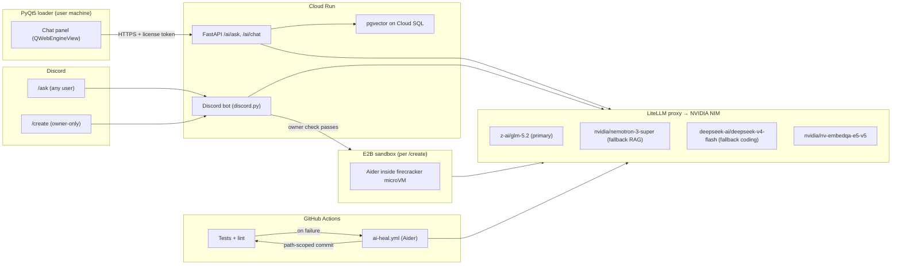

# AI Integration Plan — SteamGuard

**Status:** Proposal · v1 · 2026-07-08
**Owner:** @rivvak
**Scope:** Add AI to the SteamGuard system across three surfaces — (1) a self-healing developer agent for the repo, (2) an in-product assistant for end users (loader + Discord `/ask`), and (3) an owner-only `/create` sandboxed code-gen command.

All inference is routed through **NVIDIA NIM** (`https://integrate.api.nvidia.com/v1`, OpenAI-compatible) behind a **LiteLLM** proxy so the underlying model can be swapped with a one-line config change.

---

## 0. Reality Check (read this first)

Two things need to be corrected relative to the original brief before any code is written:

- **"Uncensored Claude Opus 4.5 from Hugging Face" does not exist.** Claude is Anthropic-proprietary and is not published to Hugging Face. Models on HF with names like `DavidAU/Llama3.3-8B-Instruct-Thinking-Heretic-Uncensored-Claude-4.5-Opus-High-Reasoning` are Llama 3.3 8B fine-tunes with marketing-style names — they are not Claude and do not have Opus-level capability.
- **The revised default is `z-ai/glm-5.2`** on NIM, an actual frontier-class open-weight model that currently leads open models on SWE-bench Pro (62.1) and Terminal-Bench 2.1 (81.0) — see the [Developers Digest benchmark writeup](https://www.developersdigest.tech/blog/glm-5-2-vs-deepseek-v4-vs-qwen3-open-weights-coding-showdown). LiteLLM keeps the door open to swap in DeepSeek V4, Nemotron 3, or any other NIM-hosted model without touching application code.

**Security note:** the NIM API key `nvapi-JjGi1zqt1AdcM1lszGOy_...` was pasted into a chat transcript and must be treated as compromised. Revoke `NVIDIABuild-Autogen-26` at [build.nvidia.com](https://build.nvidia.com/) and mint a fresh key before Phase 1 begins.

---

## 1. Goals

1. **Self-healing dev loop** — when CI fails on `rivvak/SteamGuard`, an AI agent reads the logs, produces a patch, and commits it directly to `main` for **low-risk paths only** (docs, tests, lint/format, dependency lockfiles). Anything else opens a PR.
2. **In-product assistant** — end users of the loader can ask questions about SteamGuard features from either the PyQt5 UI or a `/ask` Discord slash command, backed by RAG over `docs/`.
3. **Owner-only `/create`** — a Discord slash command scoped to your user ID that spins up an ephemeral sandbox, has the LLM write whatever you asked for (e.g. a kernel driver skeleton), and returns a zip + a new private GitHub repo under `rivvak/`.

## 2. Non-Goals

- No AI access to license validation, HWID, or certificate-pinning code — hard-blocked via CODEOWNERS and a pre-commit path guard (§7).
- No auto-merge of PRs into `main` that touch anything outside the allow-list — auto-commit is *path-scoped*, not blanket.
- No shipping of any NIM/HF/GitHub secret to the desktop client. All model calls go through the FastAPI backend.

---

## 3. Architecture



**Inference gateway.** One LiteLLM process fronts everything — desktop app, backend, bot, CI agent, and the E2B sandbox all point at `http://litellm:4000/v1`. Model swaps, per-service virtual keys, budgets, and fallback chains live in one `config.yaml`. LiteLLM's native `nvidia_nim/` provider handles the NIM endpoint transparently — see the [LiteLLM NIM provider docs](https://docs.litellm.ai/docs/providers/nvidia_nim).

**Models per surface** (defaults, swappable):

| Surface | Model | Why |
|---|---|---|
| Self-heal dev agent | `z-ai/glm-5.2` | Best open-weight SWE-bench Pro / Terminal-Bench score |
| User `/ask` + loader chat (RAG) | `nvidia/nemotron-3-super-120b-a12b` | NIM-native TensorRT throughput/cost for grounded Q&A |
| `/create` code generation | `deepseek-ai/deepseek-v4-pro` | Highest raw coding accuracy, most permissive for systems/low-level code |
| Embeddings | `nvidia/nv-embedqa-e5-v5` | Same NIM key, `input_type=passage/query` |

---

## 4. Repository Additions

New paths, no existing files touched in this doc-only commit:

```
ai/
  __init__.py
  client.py            # thin OpenAI() client factory pointed at LiteLLM proxy
  prompts/
    ask_system.md      # RAG system prompt for user Q&A
    create_system.md   # /create sandbox system prompt (owner-only)
  rag/
    ingest.py          # markdown → chunks → embeddings → pgvector
    retrieve.py        # query-time retrieval
    schema.sql         # CREATE EXTENSION vector; docs_chunks table

server/
  routes/
    ai_ask.py          # POST /ai/ask  (RAG-backed, requires valid license token)
    ai_chat.py         # POST /ai/chat (multi-turn, session-scoped)
  bot/
    cogs/
      ask_cog.py       # /ask slash command  (any guild member)
      create_cog.py    # /create slash command (owner-gated + default_permissions)

sandbox/
  create_runner.py     # Cloud Run → E2B sandbox orchestrator for /create
  Dockerfile.aider     # image used inside the E2B sandbox

.github/
  workflows/
    ai-heal.yml        # runs Aider on CI failure, path-scoped auto-commit
  CODEOWNERS           # forces human review on protected paths
  AGENTOWNERS.md       # human-readable rules the agent must follow

deploy/
  litellm/
    config.yaml        # model routing + fallbacks (see §5)

docs/
  AI_INTEGRATION_PLAN.md  # this document
  AI_USAGE.md             # user-facing help for the chat panel + /ask
  AI_AGENT_RULES.md       # what the self-heal agent may/may not touch
```

Client-side additions (loader):

```
loader/
  ai/
    chat_panel.py      # QWebEngineView-hosted chat panel
    chat_ui/
      index.html       # streaming chat widget (markdown + code blocks)
      chat.js
      chat.css
```

---

## 5. LiteLLM Configuration (`deploy/litellm/config.yaml`)

Working config — GLM-5.2 primary, Nemotron for RAG tier, DeepSeek V4 flash as coding fallback, NIM embeddings alias:

```yaml
model_list:
  - model_name: sg-primary
    litellm_params:
      model: nvidia_nim/z-ai/glm-5.2
      api_key: os.environ/NVIDIA_NIM_API_KEY

  - model_name: sg-rag
    litellm_params:
      model: nvidia_nim/nvidia/nemotron-3-super-120b-a12b
      api_key: os.environ/NVIDIA_NIM_API_KEY

  - model_name: sg-code
    litellm_params:
      model: nvidia_nim/deepseek-ai/deepseek-v4-pro
      api_key: os.environ/NVIDIA_NIM_API_KEY

  - model_name: sg-code-fast
    litellm_params:
      model: nvidia_nim/deepseek-ai/deepseek-v4-flash
      api_key: os.environ/NVIDIA_NIM_API_KEY

  - model_name: sg-embed
    litellm_params:
      model: nvidia_nim/nvidia/nv-embedqa-e5-v5
      api_key: os.environ/NVIDIA_NIM_API_KEY

router_settings:
  fallbacks:
    - sg-primary: ["sg-code", "sg-code-fast"]
    - sg-rag:     ["sg-primary"]
    - sg-code:    ["sg-code-fast", "sg-primary"]
  num_retries: 2
  request_timeout: 30
  allowed_fails: 2
  cooldown_time: 30

litellm_settings:
  drop_params: true

general_settings:
  master_key: os.environ/LITELLM_MASTER_KEY
  database_url: os.environ/LITELLM_DB_URL  # for virtual keys per surface
```

Per-surface virtual keys are minted from the master key so a desktop compromise never leaks the raw NIM key and per-surface spend caps are enforceable — see [LiteLLM reliability docs](https://docs.litellm.ai/docs/proxy/reliability).

---

## 6. Phased Rollout

### Phase 1 — User-facing `/ask` + loader chat panel (safest, ships first)

1. Rotate the leaked NIM key; store the new key in Cloud Run secrets and GitHub Actions secrets.
2. Stand up LiteLLM (Cloud Run service, private ingress) with `deploy/litellm/config.yaml`.
3. Provision pgvector on the existing Cloud SQL Postgres (`CREATE EXTENSION vector`); create `docs_chunks` table.
4. Implement `ai/rag/ingest.py` — runs on release, embeds all of `docs/` via `sg-embed`, writes to pgvector.
5. Implement `POST /ai/ask` in FastAPI — retrieves top-k chunks, calls `sg-rag`, streams response. Auth = existing license token (no anon access, keeps spend bounded to real users).
6. Add `/ask` slash command in the Discord bot cog, calling the same backend.
7. Build the `QWebEngineView` chat panel in the loader; wire it to `/ai/ask` via the existing auth session.
8. Ship behind a feature flag (`AI_ASK_ENABLED`) so rollout is reversible.

### Phase 2 — Self-healing dev agent

1. Create a dedicated GitHub App or bot account (`rivvak-sg-heal-bot`), install on `rivvak/SteamGuard` only.
2. Fine-grained PAT (or App installation token) with **only** `contents:write` on this one repo. No `workflows`, no `admin`. Short expiration + rotation.
3. Add `.github/workflows/ai-heal.yml` — triggered by workflow_run on CI failure. Runs Aider pointed at LiteLLM (`OPENAI_API_BASE=https://litellm.internal/v1`, `OPENAI_API_KEY=<sg-primary vkey>`), model `sg-primary`.
4. **Path guard.** A pre-commit step inside the workflow inspects the diff. If it touches anything outside the allow-list (`docs/**`, `tests/**`, `**/*.md`, `requirements*.txt`, `poetry.lock`), the job pivots to opening a PR instead of committing to `main`. See §7 for the deny-list.
5. Commits are signed with the bot's SSH key and tagged with a `[ai-heal]` prefix for auditability.
6. Branch protection on `main` uses `bypass_pull_request_allowances` to name **only** the heal bot, and only combined with the required CI status checks — this is the intended use of that field per GitHub's [branch-protection docs](https://docs.github.com/en/repositories/managing-your-repositorys-settings-and-features/managing-protected-branches/about-protected-branches).
7. CODEOWNERS forces human review on any path outside the allow-list regardless of author.

### Phase 3 — Owner-only `/create`

1. Sign up for E2B ($100 free hobby credit is plenty for early usage — see [E2B pricing](https://e2b.dev/pricing)).
2. Implement `sandbox/create_runner.py` in the bot: on `/create`, verify `interaction.user.id == OWNER_ID` (also enforced with `@app_commands.default_permissions(administrator=True)` for UI hiding), spin up an E2B sandbox from `sandbox/Dockerfile.aider`, run Aider with model `sg-code` and the user's prompt, capture the output tree.
3. Upload the resulting tree as a zip attachment to the Discord reply (Discord free-tier upload cap is 25 MB — larger outputs go to GitHub).
4. If output > 20 MB or `--repo` flag passed, create a new **private** repo under `rivvak` via `POST /user/repos` with `private: true`, push the tree, DM the URL.
5. Rate limit: 5 invocations / hour to keep sandbox spend bounded.

---

## 7. Security & Guardrails

### Files the AI must never modify

Enforced by a pre-commit path guard (`.github/workflows/ai-heal.yml`) and CODEOWNERS:

1. **License validation** — anywhere entitlement checks, subscription state, or key verification happens.
2. **HWID / hardware fingerprinting** — machine-binding logic. A subtly-fixed bug here silently breaks anti-sharing.
3. **Certificate pinning / TLS trust** — a "helpful" relaxation is a critical vulnerability.
4. **Secrets** — `.env*`, `*.pem`, `*.key`, service-account JSON, and anything matching common secret patterns.
5. **CI/CD** — `.github/workflows/**` (the agent must not grant itself broader permissions), deploy keys, Cloud Run bindings.
6. **Anti-tamper / signing** — packing, obfuscation, code-signing steps in the build pipeline.

Concrete SteamGuard paths currently in the deny-list:

```
auth/**
server/main.py                # if it contains license/key routes — reviewed per-PR
server/**/license*            # anything license-related
server/**/entitlement*
**/hwid*.py
**/cert*.py
**/pinning*.py
.env*
*.pem
*.key
.github/workflows/**
build.bat
Dockerfile
scripts/build*
```

### Auto-commit allow-list

Only these paths are eligible for direct-to-main commits from the heal bot:

```
docs/**
tests/**
**/*.md
requirements*.txt
poetry.lock
pyproject.toml           # dependency version bumps only, not build-system edits
```

Anything else → PR with required human review from CODEOWNERS.

### GitHub token hygiene

- Fine-grained PAT or GitHub App, **one repo**, `contents:write` only.
- Short expiration (30 days), calendared rotation.
- Stored in GitHub Actions secrets and never echoed to logs.
- Bot has its own SSH signing key so commits are cryptographically attributable.
- See [GitHub fine-grained PAT introduction](https://github.blog/security/application-security/introducing-fine-grained-personal-access-tokens-for-github/).

### End-user assistant safety

- `/ai/ask` requires a valid loader session token — no anonymous calls, no spend runaway.
- System prompt (`ai/prompts/ask_system.md`) explicitly refuses to reveal license internals, HWID logic, or admin/dashboard details. Retrieval is restricted to `docs/` (public-facing help), never `server/` or `auth/`.
- Per-user rate limit (e.g. 30 req/hour) at the FastAPI layer.

### `/create` isolation

- Runs in a fresh E2B firecracker microVM per invocation — no persistent state, no network access to Cloud Run internals.
- The sandbox is given the NIM virtual key `sg-code`, nothing else. No GitHub token unless the `--repo` flag is used, and then only a short-lived scoped installation token to create the single new repo.
- Owner-ID check is enforced server-side in the bot; Discord's UI hiding is defense-in-depth, not the primary control.

---

## 8. Cost Notes

- **NIM free developer tier**: ~40 RPM per model, no per-token billing, keys valid 6 months. Sufficient for early Phase 1 usage.
- **LiteLLM proxy**: ~1 small Cloud Run instance, ~$5/mo idle.
- **pgvector**: no extra cost — uses existing Cloud SQL.
- **E2B**: Hobby tier is one-time $100 credit, then Pro at $150/mo. At an expected 5–20 `/create` invocations/month, hobby credit lasts ~a year.
- **GitHub Actions self-heal**: cost is CI minutes — negligible at current repo size, since Aider runs are typically 30–120 seconds.

Total expected steady-state marginal cost for Phase 1: **< $20/mo**. Phases 2 and 3 add < $10/mo unless `/create` volume spikes.

---

## 9. Open Questions

1. **Do you want the loader chat panel behind the paid entitlement, or free to all logged-in loader users?** Recommendation: free to logged-in users but rate-limited, since it's a support-cost reducer.
2. **Should `/create` output default to zip attachment, or to a new private repo?** Recommendation: zip by default, repo when `--repo` flag is passed.
3. **Do you want commit-signing via GPG or SSH for the bot?** Recommendation: SSH — simpler key management on GitHub.

---

## 10. Rollout Checklist

- [ ] **Phase 0 — prerequisites**
  - [ ] Rotate leaked NIM key at build.nvidia.com
  - [ ] Store new key in Cloud Run secret manager and GitHub Actions secret `NVIDIA_NIM_API_KEY`
  - [ ] Create bot GitHub App / fine-grained PAT
- [ ] **Phase 1 — /ask + loader chat**
  - [ ] Deploy LiteLLM to Cloud Run (private)
  - [ ] Provision pgvector, run `ingest.py`
  - [ ] Ship `POST /ai/ask`
  - [ ] Ship Discord `/ask` cog
  - [ ] Ship PyQt5 chat panel behind `AI_ASK_ENABLED`
- [ ] **Phase 2 — self-heal**
  - [ ] Add CODEOWNERS + AGENTOWNERS.md + path-guard pre-commit
  - [ ] Add `.github/workflows/ai-heal.yml`
  - [ ] Configure branch protection with narrow `bypass_pull_request_allowances`
  - [ ] Dry-run on a failing test in `tests/` before enabling on `docs/`
- [ ] **Phase 3 — /create**
  - [ ] E2B account, image build
  - [ ] `sandbox/create_runner.py`
  - [ ] `create_cog.py` with owner-ID + default_permissions gate
  - [ ] Rate limit + spend cap

---

## Appendix — References

- NVIDIA NIM catalog and pricing tier: [build.nvidia.com/models](https://build.nvidia.com/models), [NIM API guide](https://jaesolshin.com/posts/nvidia-nim-api/)
- Open-weight coding benchmark comparison: [Developers Digest — GLM 5.2 vs DeepSeek V4 vs Qwen3](https://www.developersdigest.tech/blog/glm-5-2-vs-deepseek-v4-vs-qwen3-open-weights-coding-showdown)
- Aider on OpenAI-compatible endpoints: [Aider docs](https://aider.chat/docs/llms/openai-compat.html)
- LiteLLM NIM provider: [LiteLLM docs](https://docs.litellm.ai/docs/providers/nvidia_nim), [reliability/fallbacks](https://docs.litellm.ai/docs/proxy/reliability)
- Agentic CI/CD patterns and governance: [AgentMarketCap on GitHub Agentic Workflows](https://agentmarketcap.ai/blog/2026/04/07/github-actions-agentic-ci-cd-ai-native-pipelines), [Zylos AI-agent code governance](https://zylos.ai/zh/research/2026-06-28-ai-agent-code-governance-branch-protection-review-gates/)
- GitHub fine-grained PATs: [github.blog announcement](https://github.blog/security/application-security/introducing-fine-grained-personal-access-tokens-for-github/)
- Sandbox comparison for `/create`: [AgentMarketCap sandbox roundup](https://agentmarketcap.ai/blog/2026/04/07/ai-agent-sandbox-infrastructure-e2b-modal-daytona-fly-machines-secure-code-execution), [E2B pricing](https://e2b.dev/pricing)
- Discord slash commands (2026): [Space-Node comparison](https://space-node.net/blog/discordpy-alternatives-python-bot-libraries-2026), [discord.py masterclass](https://fallendeity.github.io/discord.py-masterclass/slash-commands/)
- CODEOWNERS / agent-owner patterns: [GitHub CODEOWNERS docs](https://docs.github.com/en/repositories/managing-your-repositorys-settings-and-features/customizing-your-repository/about-code-owners), [Agent Rule Gen guide](https://agentrulegen.com/guides/how-to-protect-files-from-ai-agents)
