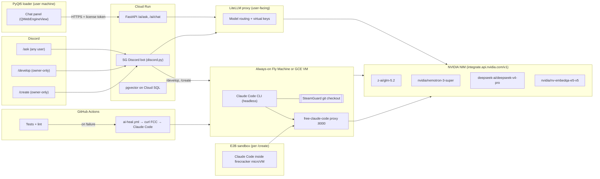

# AI Integration Plan — SteamGuard

**Status:** Proposal · v2 · 2026-07-08
**Owner:** @rivvak
**Scope:** Add AI to the SteamGuard system across three surfaces — (1) a self-healing developer agent for the repo (Claude Code via [free-claude-code](https://github.com/Alishahryar1/free-claude-code)), (2) an in-product assistant for end users (loader + Discord `/ask`), and (3) an owner-only `/create` sandboxed code-gen command plus `/develop` for repo work.

All inference is routed through **NVIDIA NIM** (`https://integrate.api.nvidia.com/v1`, OpenAI-compatible) — either directly via **LiteLLM** for the user-facing surfaces, or via the **free-claude-code proxy** which speaks the Anthropic Messages API to Claude Code CLI and translates to NIM.

Changes from v1: user chat panel is **free to all logged-in loader users** (not paywalled). `/create` always returns a **zip** attachment. New `/develop` command added — owner-only, runs Claude Code (via FCC) against the SteamGuard repo for autonomous multi-file work. The self-heal loop and `/develop` are now unified on Claude Code, not Aider.

---

## 0. Reality Check (read this first)

- **"Uncensored Claude Opus 4.5 from Hugging Face" is not real.** Claude is Anthropic-proprietary. HF fine-tunes with names like `DavidAU/…-Claude-4.5-Opus-…` are Llama 3.3 8B derivatives with marketing names — they are not Claude and do not have Opus-level capability.
- **The revised default** is **real Claude Code CLI** (the actual Anthropic product) running against **NIM-hosted GLM-5.2 / DeepSeek V4 / Nemotron 3** via the `free-claude-code` proxy. This gets you the world-class Claude Code UX for autonomous coding, billed against your free NIM key.
- **Security note:** the NIM API key `nvapi-JjGi1zqt1AdcM1lszGOy_...` was pasted in a chat transcript and must be treated as compromised. Revoke `NVIDIABuild-Autogen-26` at [build.nvidia.com](https://build.nvidia.com/) before Phase 1.

---

## 1. Goals

1. **Self-healing dev loop** — when CI fails on `rivvak/SteamGuard`, Claude Code (via FCC → NIM) reads the logs, produces a patch, and commits it directly to `main` for **low-risk paths only** (docs, tests, lint/format, dependency lockfiles). Anything else opens a PR.
2. **In-product assistant** — end users of the loader can ask questions about SteamGuard from either the PyQt5 UI or a `/ask` Discord slash command, backed by RAG over `docs/`. Free to all logged-in loader users.
3. **Owner-only `/develop`** — Discord slash command scoped to your user ID. Streams a Claude Code session that operates on the SteamGuard repo directly — like the self-heal loop but user-initiated ("fix issue #12", "add a settings dialog", "refactor the loader auth flow"). Commits to a feature branch and opens a PR unless you say `--push-main` for allow-listed paths.
4. **Owner-only `/create`** — Discord slash command that spins up an ephemeral E2B sandbox, has Claude Code write whatever you asked for (kernel driver skeleton, standalone tool, etc.), and returns the result as a **zip attachment** in the Discord reply.

## 2. Non-Goals

- No AI access to license validation, HWID, or certificate-pinning code — hard-blocked via CODEOWNERS and a pre-commit path guard (§7).
- No auto-merge of PRs that touch anything outside the allow-list.
- No shipping of any NIM/HF/GitHub secret to the desktop client. All model calls go through the FastAPI backend or the FCC proxy.

---

## 3. Architecture



**Two inference paths, one NIM key:**

1. **User-facing surfaces** (loader chat, `/ask`, RAG) → **LiteLLM proxy** on Cloud Run → NIM. Direct OpenAI-compat calls. Lightweight, stateless, scales to zero.
2. **Developer surfaces** (self-heal CI, `/develop`, `/create`) → **free-claude-code proxy** on a small always-on VM → NIM. Speaks Anthropic Messages API to Claude Code CLI, which does the actual code editing.

**Why not Cloud Run for FCC?** Its README explicitly says *"Do not open Docker integration PRs"* — the project targets local/VM installs with `uv`. Claude Code also needs a stateful working directory with a checked-out git tree. Cloud Run's ephemeral-container model fights both. A single small VM (Fly Machine at ~$2/mo shared CPU, or a `e2-small` GCE VM at ~$13/mo) is the right home. You already use GCP so a GCE VM in the same project as Cloud Run is the path of least resistance — but Fly Machines are cheaper and per-second billed. **Recommendation: Fly Machine.**

**Models per surface** (defaults, swappable):

| Surface | Model | Why |
|---|---|---|
| Self-heal + `/develop` (Claude Code via FCC) | `z-ai/glm-5.2` | Best open-weight SWE-bench Pro / Terminal-Bench; agentic reasoning + tool use |
| User `/ask` + loader chat (RAG) | `nvidia/nemotron-3-super-120b-a12b` | NIM-native TensorRT throughput/cost for grounded Q&A |
| `/create` code generation | `deepseek-ai/deepseek-v4-pro` | Highest raw coding accuracy; most permissive for low-level/systems code |
| Embeddings | `nvidia/nv-embedqa-e5-v5` | Same NIM key, `input_type=passage/query` |

---

## 4. Repository Additions

```
ai/
  __init__.py
  client.py                # OpenAI() factory pointed at LiteLLM
  prompts/
    ask_system.md          # RAG system prompt for user Q&A
    create_system.md       # /create sandbox system prompt
    develop_system.md      # /develop system prompt (Claude Code-facing)
  rag/
    ingest.py              # markdown → chunks → embeddings → pgvector
    retrieve.py
    schema.sql

server/
  routes/
    ai_ask.py              # POST /ai/ask   (RAG, license-token gated)
    ai_chat.py             # POST /ai/chat  (multi-turn, session-scoped)
  bot/
    cogs/
      ask_cog.py           # /ask   (any guild member)
      develop_cog.py       # /develop (owner-gated, forwards to VM)
      create_cog.py        # /create (owner-gated, forwards to E2B)

vm/                        # deployed to Fly Machine, NOT Cloud Run
  README.md                # how to deploy FCC + Claude Code
  fly.toml
  Dockerfile.fcc           # minimal wrapper around free-claude-code
  fcc-config/
    settings.yaml          # provider = nim, model routing
  develop-webhook/
    server.py              # tiny FastAPI that receives /develop + /heal jobs
                           # from the Cloud Run bot and runs Claude Code
                           # against a git worktree

sandbox/
  create_runner.py         # spawns E2B sandbox, injects FCC endpoint,
                           # runs Claude Code with prompt, zips output
  Dockerfile.claude        # E2B image with Claude Code + FCC client

.github/
  workflows/
    ai-heal.yml            # on CI failure, calls VM webhook with logs
  CODEOWNERS
  AGENTOWNERS.md

deploy/
  litellm/
    config.yaml            # user-facing routing (NIM primary + fallbacks)

docs/
  AI_INTEGRATION_PLAN.md   # this document
  AI_USAGE.md              # user help for chat panel + /ask
  AI_AGENT_RULES.md        # what agents may/may not touch
```

Client-side additions (loader):

```
loader/
  ai/
    chat_panel.py          # QWebEngineView-hosted chat
    chat_ui/index.html     # streaming widget (markdown + code blocks)
    chat_ui/chat.js
    chat_ui/chat.css
```

---

## 5. LiteLLM Configuration (`deploy/litellm/config.yaml`)

Same as v1 — user-facing surfaces only:

```yaml
model_list:
  - model_name: sg-primary
    litellm_params:
      model: nvidia_nim/z-ai/glm-5.2
      api_key: os.environ/NVIDIA_NIM_API_KEY

  - model_name: sg-rag
    litellm_params:
      model: nvidia_nim/nvidia/nemotron-3-super-120b-a12b
      api_key: os.environ/NVIDIA_NIM_API_KEY

  - model_name: sg-code
    litellm_params:
      model: nvidia_nim/deepseek-ai/deepseek-v4-pro
      api_key: os.environ/NVIDIA_NIM_API_KEY

  - model_name: sg-code-fast
    litellm_params:
      model: nvidia_nim/deepseek-ai/deepseek-v4-flash
      api_key: os.environ/NVIDIA_NIM_API_KEY

  - model_name: sg-embed
    litellm_params:
      model: nvidia_nim/nvidia/nv-embedqa-e5-v5
      api_key: os.environ/NVIDIA_NIM_API_KEY

router_settings:
  fallbacks:
    - sg-primary: ["sg-code", "sg-code-fast"]
    - sg-rag:     ["sg-primary"]
  num_retries: 2
  request_timeout: 30

litellm_settings:
  drop_params: true

general_settings:
  master_key: os.environ/LITELLM_MASTER_KEY
```

Reference: [LiteLLM NIM provider docs](https://docs.litellm.ai/docs/providers/nvidia_nim).

---

## 6. free-claude-code Deployment (developer surfaces)

Adopted from [Alishahryar1/free-claude-code](https://github.com/Alishahryar1/free-claude-code). MIT-licensed FastAPI middleware that speaks Anthropic Messages API to Claude Code CLI and translates the calls to NIM (or 20+ other providers). Its own tagline: *"Middleware between Claude Code CLI (Anthropic API) and NVIDIA NIM"*.

**Why this instead of Aider (v1 recommendation):**
- Gives you the actual Claude Code CLI + VS Code extension experience — best-in-class autonomous coding agent UX today — but on your free NIM key.
- Ships with a built-in Discord bot that runs Claude Code sessions remotely with `/stop`, `/clear`, `/stats` commands — much of the `/develop` UX is already built.
- Also fronts Codex CLI (OpenAI Responses API shape) for a second opinion / A-B testing.
- MIT license, Python 3.14, active development.

**Deployment layout** (`vm/`):

- Fly Machine, `shared-cpu-1x@256mb` region `iad` (near GitHub webhooks).
- Runs `uv run fcc-server` in the foreground (per FCC's Quick Start).
- FCC's Admin UI is bound to loopback only — expose it through Fly's `wireguard` for admin, never publicly.
- A tiny FastAPI companion (`develop-webhook/server.py`) receives:
  - `POST /heal` from GitHub Actions with CI logs + PR/branch context.
  - `POST /develop` from the SG Discord bot with the owner's prompt.
  - Both do: `git fetch && git worktree add …` for the target branch, then invoke Claude Code headless (`fcc-claude --prompt "…" --allow-write`) inside that worktree, then push.

**FCC provider config** (`vm/fcc-config/settings.yaml`, applied via Admin UI on first run):

```yaml
provider: nim
model_primary: z-ai/glm-5.2
model_fallback: deepseek-ai/deepseek-v4-pro
api_key_env: NVIDIA_NIM_API_KEY

messaging:
  platform: discord
  discord_bot_token_env: SG_DEV_BOT_TOKEN     # separate from user-facing bot
  allowed_discord_channels: ["<owner-DM-channel-id>"]
  allowed_directory: /workspace/SteamGuard
```

**Two Discord bots on purpose:**
- The user-facing SG bot (`/ask`) lives on Cloud Run and never has git access.
- FCC's built-in dev bot (`/stop`, `/clear`, `/stats` + free-form Claude Code sessions) lives on the Fly Machine with repo write access, and is scoped to your DM channel only.

`/develop` in the SG bot forwards to the VM webhook and returns the PR URL; direct interactive Claude Code sessions still happen through FCC's own bot in your DM channel — you get both automated ticketed workflow and free-form REPL.

---

## 7. Phased Rollout

### Phase 1 — User-facing `/ask` + loader chat panel (safest, ships first)

1. Rotate the leaked NIM key. Store in Cloud Run secrets and GitHub Actions.
2. Stand up LiteLLM on Cloud Run (private ingress) with `deploy/litellm/config.yaml`.
3. `CREATE EXTENSION vector` on existing Cloud SQL; create `docs_chunks` table.
4. `ai/rag/ingest.py` — runs on release, embeds all of `docs/` via `sg-embed`.
5. `POST /ai/ask` in FastAPI — retrieves top-k chunks, calls `sg-rag`, streams response. Auth = existing license token so it's free to all logged-in users but not anonymous.
6. Add `/ask` slash cog in the SG Discord bot.
7. Build the `QWebEngineView` chat panel in the loader; wire to `/ai/ask`.
8. Ship behind `AI_ASK_ENABLED` feature flag.

### Phase 2 — Self-healing CI + `/develop` (both use FCC on the VM)

1. Create a dedicated GitHub App (`rivvak-sg-heal-bot`); install on `rivvak/SteamGuard` only. `contents:write` fine-grained scope, one repo.
2. Spin up the Fly Machine, `uv tool install free-claude-code`, verify Claude Code CLI installs cleanly, configure FCC pointed at NIM via Admin UI over WireGuard.
3. Deploy `vm/develop-webhook/server.py` on the same VM, listening on a signed webhook endpoint (HMAC with a shared secret in GitHub Actions + Cloud Run).
4. Configure FCC's own Discord bot with `SG_DEV_BOT_TOKEN` + your DM channel ID — this is the free-form Claude Code REPL in Discord.
5. `.github/workflows/ai-heal.yml` — on `workflow_run` failure, POSTs logs + branch to the VM webhook. VM checks out a worktree, runs Claude Code, path-guards the diff (§8), commits + pushes, or opens a PR.
6. `/develop <prompt>` cog in the SG Discord bot — POSTs to the same webhook with `mode=develop`. VM creates `ai/develop/<slug>` branch, runs Claude Code, opens PR, returns URL.
7. Dry-run everything on `tests/` and `docs/` before allowing any path in the auto-commit allow-list.

### Phase 3 — `/create` sandboxed code-gen

1. Sign up for E2B — the $100 free hobby credit is more than enough (see [E2B pricing](https://e2b.dev/pricing)).
2. Build `sandbox/Dockerfile.claude` — includes Claude Code CLI + FCC client + the NIM key mounted at runtime (never baked in).
3. `sandbox/create_runner.py` — on `/create` from your Discord user ID (double-checked server-side + `@app_commands.default_permissions(administrator=True)` for UI hiding), spins up E2B sandbox, runs Claude Code with the prompt, waits for completion, zips the output tree, replies with the zip as a Discord attachment.
4. Discord free-tier upload cap is 25 MB. If output exceeds that, fall back to uploading to a temporary private gist and returning the URL.
5. Rate limit: 5 invocations/hour to keep sandbox spend bounded.

---

## 8. Security & Guardrails

### Files agents must never modify

Enforced by (a) a pre-commit path guard on the VM before it pushes anything, (b) CODEOWNERS on GitHub requiring human review, (c) `AGENTOWNERS.md` as a prompt-level rule Claude Code is instructed to read.

1. **License validation** — entitlement checks, key verification, subscription state.
2. **HWID / hardware fingerprinting** — machine-binding and anti-sharing logic.
3. **Certificate pinning / TLS trust** — a "helpful" relaxation is a critical vulnerability.
4. **Secrets** — `.env*`, `*.pem`, `*.key`, service-account JSON.
5. **CI/CD** — `.github/workflows/**`, deploy keys, Cloud Run bindings. The agent must never grant itself broader permissions by editing its own pipeline.
6. **Anti-tamper / signing** — packing, obfuscation, code-signing steps.

Concrete SteamGuard paths currently in the deny-list:

```
auth/**
server/**/license*
server/**/entitlement*
**/hwid*.py
**/cert*.py
**/pinning*.py
.env*
*.pem
*.key
.github/workflows/**
build.bat
Dockerfile
scripts/build*
```

### Auto-commit-to-main allow-list

```
docs/**
tests/**
**/*.md
requirements*.txt
requirements_client.txt
pyproject.toml       # dep bumps only; build-system edits require PR
```

Anything outside this list → PR + CODEOWNERS review, no exceptions.

### `/develop` behavior

- **Default:** commits to `ai/develop/<slug>` branch, opens PR, tags you for review. No direct push to `main`.
- **`--push-main` flag:** allowed **only** when every changed path is in the auto-commit allow-list; otherwise the flag is rejected server-side and the run pivots to PR mode. This gives you a fast path for docs/test fixes while keeping guardrails intact.

### GitHub token hygiene

- Fine-grained PAT or GitHub App, **one repo**, `contents:write` only. No `workflows` write.
- 30-day expiration, calendared rotation.
- Stored on the Fly Machine via `fly secrets` and in GitHub Actions secrets — never in code or logs.
- Bot has an SSH signing key so every commit is cryptographically attributable.
- Reference: [GitHub fine-grained PAT introduction](https://github.blog/security/application-security/introducing-fine-grained-personal-access-tokens-for-github/).

### End-user assistant safety

- `/ai/ask` requires a valid loader session token — no anonymous calls.
- System prompt refuses to reveal license internals, HWID logic, or admin details. Retrieval is restricted to `docs/`.
- Per-user rate limit (30 req/hour) at the FastAPI layer.

### `/create` isolation

- Fresh E2B firecracker microVM per invocation — no persistent state, no network access to Cloud Run internals.
- Sandbox only holds the NIM virtual key `sg-code`. No GitHub token — output is zipped and returned; nothing gets pushed anywhere unless you explicitly do it afterward.
- Owner-ID check enforced server-side in the bot; Discord's UI hiding is defense-in-depth.

---

## 9. Cost Notes

- **NIM free developer tier**: ~40 RPM per model, no per-token billing, keys valid 6 months. Sufficient for early usage.
- **LiteLLM proxy on Cloud Run**: ~$5/mo idle.
- **pgvector on existing Cloud SQL**: no extra cost.
- **Fly Machine for FCC**: `shared-cpu-1x@256mb` ≈ $2/mo. Persistent volume for the repo checkout ≈ $0.15/GB/mo (1 GB = negligible).
- **E2B**: Hobby $100 one-time credit; at ~5–20 `/create` runs/month the credit lasts about a year.
- **Actions**: negligible; each self-heal run is a webhook + a few seconds of workflow.

Total expected marginal cost at steady state: **< $10–15/mo** across all three phases.

---

## 10. Open Decisions (resolved from prior turns)

- ✅ **Loader chat panel is free to all logged-in loader users**, license-token-gated (not anonymous, not paywalled). Rate-limited at 30 req/hour.
- ✅ **`/create` always returns a zip attachment** in Discord; falls back to a temporary private gist URL only if output > 25 MB.
- ✅ **`/develop` is the new owner-only repo-editing command** — Claude Code via FCC → NIM, defaults to PR, `--push-main` allowed only inside the allow-list.
- ✅ **free-claude-code adopted** as the developer-side agent runner instead of Aider (v1's pick). Gets you the real Claude Code CLI experience on your NIM key.
- **Deploy target for FCC**: Fly Machine, not Cloud Run — FCC explicitly does not support Docker/Cloud-Run-style deploys and Claude Code needs a persistent working directory. Cloud Run keeps hosting LiteLLM + FastAPI + user-facing bot as originally planned.

---

## 11. Rollout Checklist

- [ ] **Phase 0 — prerequisites**
  - [ ] Rotate the leaked NIM key at build.nvidia.com
  - [ ] Store new key in Cloud Run secrets + GitHub Actions + Fly secrets
  - [ ] Create bot GitHub App with fine-grained scope
- [ ] **Phase 1 — /ask + loader chat**
  - [ ] Deploy LiteLLM to Cloud Run (private)
  - [ ] Provision pgvector, run `ingest.py`
  - [ ] Ship `POST /ai/ask`
  - [ ] Ship SG bot `/ask` cog
  - [ ] Ship PyQt5 chat panel behind `AI_ASK_ENABLED`
- [ ] **Phase 2 — self-heal + /develop (both via FCC on Fly)**
  - [ ] Provision Fly Machine, install FCC, verify Claude Code end-to-end
  - [ ] Deploy `develop-webhook/server.py` on the same VM (HMAC-signed)
  - [ ] Configure FCC's own Discord bot for your DM channel (free-form REPL)
  - [ ] Add CODEOWNERS + AGENTOWNERS.md + path-guard on the VM
  - [ ] Add `.github/workflows/ai-heal.yml`
  - [ ] Configure branch protection with narrow `bypass_pull_request_allowances` for the bot
  - [ ] Ship SG bot `/develop` cog forwarding to the VM webhook
  - [ ] Dry-run on `tests/` before enabling allow-listed paths
- [ ] **Phase 3 — /create**
  - [ ] E2B account, build `Dockerfile.claude` image
  - [ ] Ship `sandbox/create_runner.py`
  - [ ] Ship SG bot `/create` cog with owner-ID + `default_permissions` gate
  - [ ] Rate limit + spend cap

---

## Appendix — References

- [free-claude-code](https://github.com/Alishahryar1/free-claude-code) — the Anthropic-API proxy in front of NIM. MIT license.
- NIM catalog: [build.nvidia.com/models](https://build.nvidia.com/models); [NIM API guide](https://jaesolshin.com/posts/nvidia-nim-api/)
- Open-weight coding benchmarks (GLM-5.2 vs DeepSeek V4 vs Qwen3): [Developers Digest](https://www.developersdigest.tech/blog/glm-5-2-vs-deepseek-v4-vs-qwen3-open-weights-coding-showdown)
- LiteLLM NIM provider: [docs.litellm.ai](https://docs.litellm.ai/docs/providers/nvidia_nim); reliability/fallbacks: [reliability docs](https://docs.litellm.ai/docs/proxy/reliability)
- Agentic CI/CD patterns: [AgentMarketCap on GitHub Agentic Workflows](https://agentmarketcap.ai/blog/2026/04/07/github-actions-agentic-ci-cd-ai-native-pipelines); [Zylos AI-agent code governance](https://zylos.ai/zh/research/2026-06-28-ai-agent-code-governance-branch-protection-review-gates/)
- GitHub fine-grained PATs: [github.blog announcement](https://github.blog/security/application-security/introducing-fine-grained-personal-access-tokens-for-github/)
- Sandbox comparison for `/create`: [AgentMarketCap sandbox roundup](https://agentmarketcap.ai/blog/2026/04/07/ai-agent-sandbox-infrastructure-e2b-modal-daytona-fly-machines-secure-code-execution); [E2B pricing](https://e2b.dev/pricing)
- Discord slash commands: [discord.py masterclass](https://fallendeity.github.io/discord.py-masterclass/slash-commands/)
- CODEOWNERS: [GitHub docs](https://docs.github.com/en/repositories/managing-your-repositorys-settings-and-features/customizing-your-repository/about-code-owners); [Agent Rule Gen guide](https://agentrulegen.com/guides/how-to-protect-files-from-ai-agents)
